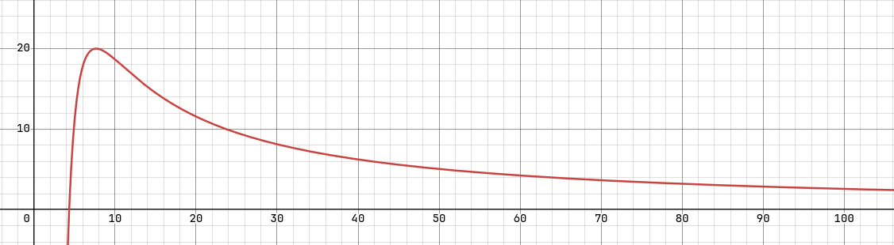

TODO - REMOVE BEFORE RELEASE
# Mapgen Explanation
## Terrain
Islands and water are based on terrain elevation. Elevation itself uses a basis_noise as a baseline. A scaled sigmoid which is based on the distance is added to make the islands bigger the further you get out while still limiting the maximum size of each island.\
Beaches only contain sand-4 while the inner landmass only contains sand-5.

## Trees and Gardens
Trees and gardens can only spawn on sand-5 which ensures they only spawn in the middle of an island. A multioctave noise with "large islands" is then overlayed and ensures that the same type spawns in roughly the same area (desert only near desert, temperate only near temperate etc.). A basis_noise is used so trees don't appear too clustered in one spot. A shited hyperbolic rational is added to increase the chance of a tree/garden island within the spawn radius. This is to help the player obtain trees/gardens without having to fight enemies first.
*shifted hyperbolic rational*

## Enemies
The enemy autoplace function is a translation of the 1.1 autoplace function and mixes elevation and probabilities with random noise to get a dense yet random worm placement.